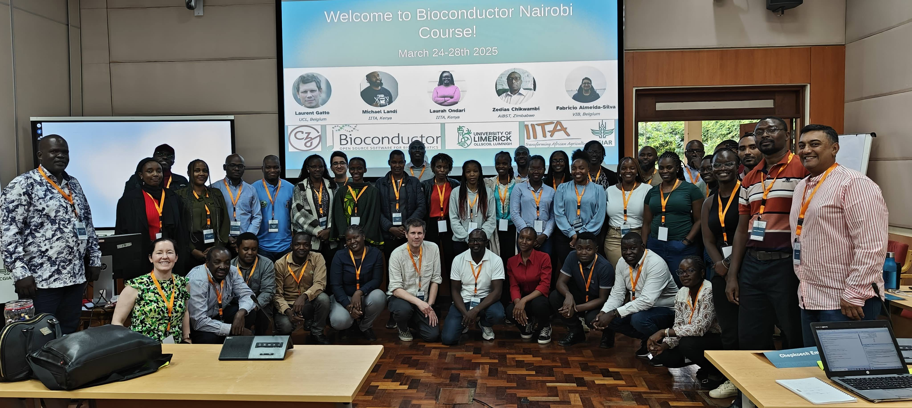

# Bioconductor Workshop Kenya

- [Workshop page](https://training.bioconductor.org/workshops/2025-03-Nairobi/index.html)
- This page: https://github.com/lgatto/202503-Bioconductor-Kenya
- Shared notes: https://pad.carpentries.org/bioc-nairobi-2025

## Introduction to data analysis with R and Bioconductor

- Mon - Tue
- Course page: https://carpentries-incubator.github.io/bioc-intro
- data: https://github.com/carpentries-incubator/bioc-intro/raw/main/episodes/data/rnaseq.csv
- RStudio project: [bioc-intro](https://github.com/lgatto/202503-Bioconductor-Kenya/tree/main/bioc-intro)

## RNA-seq analysis with Bioconductor

- Wed - Thu
- Course page: https://carpentries-incubator.github.io/bioc-rnaseq/
- RStudio project (group Fabricio and Zedias): [bioc-rnaseq2](https://github.com/lgatto/202503-Bioconductor-Kenya/tree/main/bioc-rnaseq2)
- RStudio project (group Laurent and Mike): [bioc-bioc-rnaseq](https://github.com/lgatto/202503-Bioconductor-Kenya/tree/main/bioc-rnaseq)

## Bring your own data

- Fri

## Installation

- [R](https://carpentries-incubator.github.io/bioc-intro/)
- [RStudio](https://carpentries-incubator.github.io/bioc-intro/)

